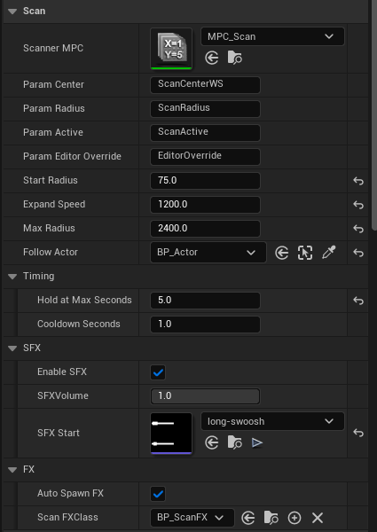
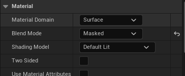
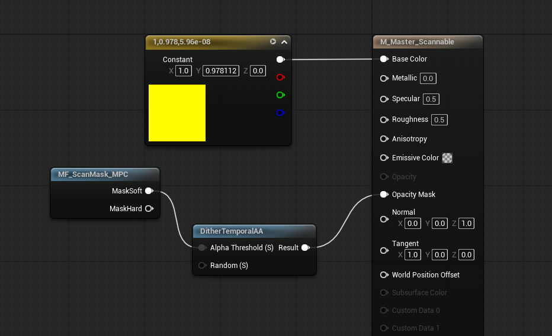
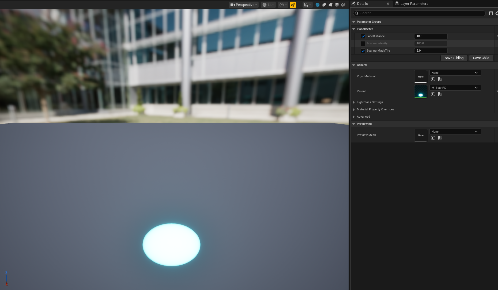

# 📘 SphereReveal – User Guide (v1.0)


## 1️⃣ Introduction

**Plugin Name:** SphereReveal
**Version:** 1.0 (Beta)
**Purpose:** Reveal only objects inside a growing sphere — ideal for scanning, pulse, or detection effects.

**Core Components:**

* Material Function: `MF_SphereRevealMask`
* Material Parameter Collection: `MPC_Scanner`
* Controller Actor (C++ / BP): `BP_ScannerController`
* Optional FX Mesh: `M_ScanFX`

📷 *(이미지 1)* — 전체 구조 다이어그램 (Sphere + Mask + Controller)

---

## 2️⃣ Installation

1. Copy the **SphereReveal** folder into your project’s `/Plugins/` directory.
2. Restart Unreal Editor.
3. Enable the plugin from **Edit → Plugins → Installed → SphereReveal**.
4. Restart again if prompted.


---

## 3️⃣ Quick Start

1. Add `BP_ScannerController` into your Level.
2. Assign the `MPC_Scanner` asset in its details panel.
   - Check `Audio` folder and assign `SFX`, if you need.

3. If needed, assign a `FollowActor` (the actor to track).
4. In your Blueprint or code, call:


```
// *.uproject
	"Plugins": [
         // ...
		{
			"Name":"SphereReveal",
			"Enabled": true
		}
```
```c++
#include "ScanFunctionLibrary.h"
#include "ScannerController.h"

// ...

	if (AScannerController* Scanner = UScanFunctionLibrary::GetSphereRevealController(GetWorld()))
	{
		Scanner->StartScan();
	}
```

5. Watch the reveal effect expand from your sphere center.


---

## 4️⃣ Material Integration

To apply the reveal mask:

1. Open your target material.
2. Add `MF_ScanMask_MPC`.
3. Make sure Material `Blend Mode` is set to **Masked**.

4. Connect `MaskSoft` or `MaskHard` to **Opacity Mask** (for Masked blend).



---

## 5️⃣ Parameters Overview

| **Parameter**             | **Type**                      | **Description**                                                                              |
| ------------------------- | ----------------------------- | -------------------------------------------------------------------------------------------- |
| **Scanner MPC**           | `MaterialParameterCollection` | Reference to the Material Parameter Collection that controls the reveal (e.g., `MPC_Scan`).  |
| **Param Center**          | `Name`                        | Parameter name in MPC for sphere world position (default: `ScanCenterWS`).                   |
| **Param Radius**          | `Name`                        | Parameter name in MPC for current sphere radius (default: `ScanRadius`).                     |
| **Param Active**          | `Name`                        | Parameter name in MPC indicating whether the scan is active (default: `ScanActive`).         |
| **Param Editor Override** | `Name`                        | Allows previewing the effect inside the editor (default: `EditorOverride`).                  |
| **Start Radius**          | `Float`                       | Initial scan radius when activated (default: `75.0`).                                        |
| **Expand Speed**          | `Float`                       | Expansion rate of the sphere in cm/s (default: `1200.0`).                                    |
| **Max Radius**            | `Float`                       | Maximum expansion limit for the scan (default: `2400.0`).                                    |
| **Follow Actor**          | `Actor`                       | The actor whose world position the scan will follow (e.g., player or object).                |
| **Hold at Max Seconds**   | `Float`                       | Duration (in seconds) to stay fully expanded before disappearing (default: `5.0`).           |
| **Cooldown Seconds**      | `Float`                       | Delay (in seconds) before the next scan can start (default: `1.0`).                          |
| **Enable SFX**            | `Bool`                        | Enables sound playback when the scan starts.                                                 |
| **SFX Volume**            | `Float`                       | Controls playback volume of the start sound (range: 0.0–1.0).                                |
| **SFX Start**             | `SoundBase`                   | Optional sound played when the scan begins (e.g., “long-swoosh”).                            |
| **Auto Spawn FX**         | `Bool`                        | Automatically spawns the visual FX sphere actor (`BP_ScanFX`).                               |
| **Scan FX Class**         | `ActorClass`                  | Visual representation for the scan sphere, usually a translucent mesh material (`M_ScanFX`). |

---

## 6️⃣ Optional: Scan FX Mesh

Use `BP_ScanFX` or `M_ScanFX` for a visual pulse sphere.

* Material: Translucent + Depth Fade
* Automatically scales with `ScanRadius`
* Useful for radar-style visuals or holographic scans



---

## 7️⃣ Version History

| Version         | Changes                                                     | Notes       |
| --------------- | ----------------------------------------------------------- | ----------- |
| **v1.0 (Beta)** | Initial release: Single scan system, FX mesh, SFX, cooldown | MVP release |

> 🔜 **v1.1 (Planned)** — Multi-scan support, replication features, modular component refactor

---

## 8️⃣ Contact / Support

📧 **Email:** [ghdud0503@gmail.com](mailto:ghdud0503@gmail.com)
🐞 **Issues:** [Open a GitHub Issue](https://github.com/Ho-yeong/SphereRevealDocs/issues)
📄 *Documentation:* Coming soon, [Studio3F YouTube](https://www.youtube.com/@studio_3f)